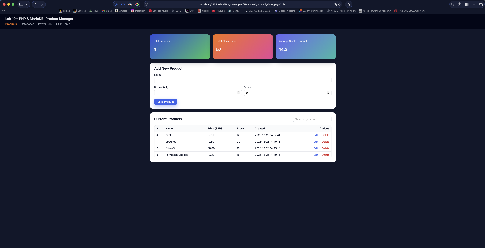
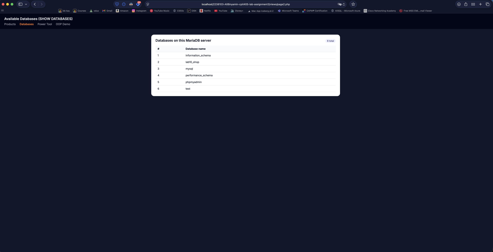
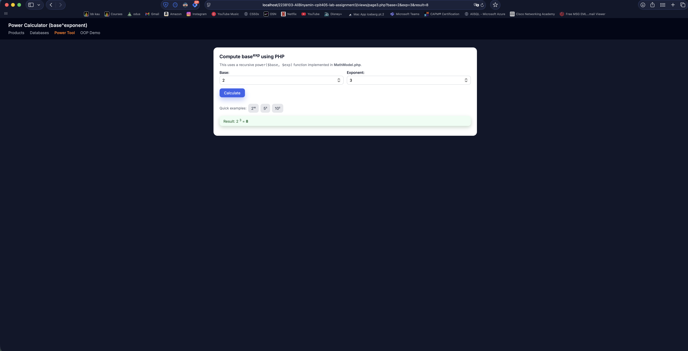
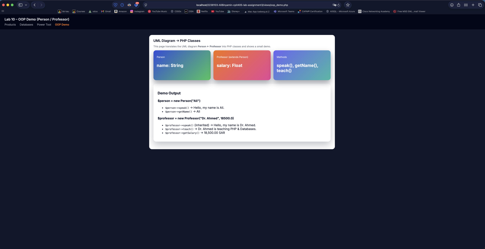

# 🧪 Lab 10 – PHP, MariaDB, MVC & OOP (CPIT-405)

### 👤 Student Information
- **Name:** Ali Binyamin  
- **ID:** 2238103  
- **Course:** CPIT-405 – Web Development  
- **Lab:** 10 – PHP & MariaDB Programming  

---

## 📌 Overview

This project demonstrates building a **complete PHP application** using:

- MVC Architecture  
- PHP OOP (Inheritance & Methods)  
- MariaDB SQL Queries  
- CRUD Operations  
- Recursive PHP function (Power Calculator)  
- UML → PHP class translation  
- Organized UI with navigation  

---

## 📁 Project Structure

```
2238103-AliBinyamin-cpit405-lab-assignment3/
│
├── controllers/
│   ├── productController.php
│   ├── mathController.php
│
├── models/
│   ├── Database.php
│   ├── ProductModel.php
│   ├── MathModel.php
│   ├── PersonProfessor.php
│
├── views/
│   ├── page1.php        (Products CRUD)
│   ├── page2.php        (SHOW DATABASES)
│   ├── page3.php        (Power Calculator)
│   ├── oop_demo.php     (UML → PHP OOP Demo)
│   ├── components/
│       ├── navbar.php
│
├── css/
│   ├── style1.css
│
├── js/
│   ├── script1.js
│
└── Documents/
    ├── db-install-statements.sql
```

---

## 🧭 Navigation & Pages

- **Products** → Add, Edit, Delete, View  
- **Databases** → `SHOW DATABASES` query  
- **Power Tool** → Recursive power function  
- **OOP Demo** → Person & Professor classes (UML translation)

---

## 🛠 How to Run the Project

### 1. Install XAMPP
Download from:  
https://www.apachefriends.org/

### 2. Move project into:
```
/Applications/XAMPP/xamppfiles/htdocs/
```

### 3. Start Services
- Apache ✔  
- MySQL ✔  

### 4. Import Database
Using phpMyAdmin:

1. Create database: `lab10_shop`
2. Import:
```
Documents/db-install-statements.sql
```

### 5. Open the app
```
http://localhost/2238103-AliBinyamin-cpit405-lab-assignment3/views/page1.php
```

---

## 📸 Screenshots (UI Preview)

### **1️⃣ Products Manager (CRUD + Stats UI)**


### **2️⃣ Databases Viewer (SHOW DATABASES)**


### **3️⃣ Power Tool – Recursive Function**


### **4️⃣ UML → PHP OOP Demo (Person / Professor)**


---

## 🧩 Lab Requirements & Completion

### ✔ 1. Recursive `power($base, $exp)` Function  
Implemented in:

```
models/MathModel.php
```

Demo in `views/page3.php`.

---

### ✔ 2. UML Diagram → PHP Classes  
UML: **Person → Professor**  

Implemented in:

```
models/PersonProfessor.php
```

Demo in `views/oop_demo.php`.

---

### ✔ 3. `SHOW DATABASES` SQL Query
Implemented in:

```
models/Database.php
views/page2.php
```

Displays all databases on the MariaDB server.

---

### ✔ 4. CRUD Operations (Products)
- Add product  
- Edit product  
- Delete product  
- View all products  
- Stats summary (Total Products, Total Stock, Average Stock)  

---

## 🎯 Final Notes

This lab fully implements:

- MVC architecture  
- Database CRUD  
- SQL `SHOW DATABASES`  
- Recursive power function  
- UML class translation  
- Clean UI + Navbar  
- Organized documentation with screenshots  

Everything required in CPIT-405 Lab 10 is completed successfully.

---

### 🚀 Prepared professionally for CPIT-405 Lab Submission.
